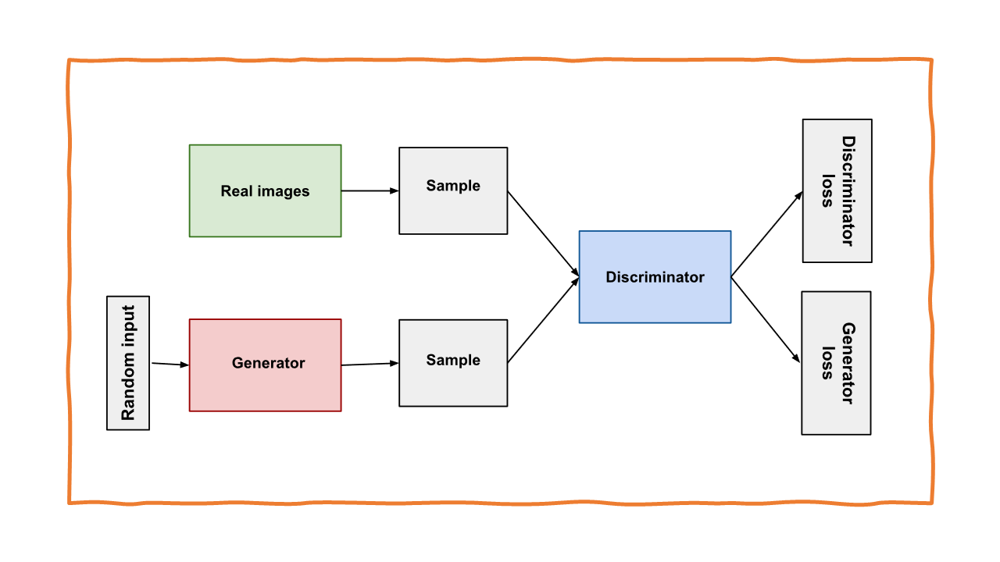

# 生成对抗网络 Generative-Adversarial-Network（GAN）

生成对抗网络（GAN）是一种深度学习框架，它包括两个神经网络：生成器和判别器，这两个网络通过对抗的方式进行训练。生成器网络创建类似于训练数据的新数据样本，而判别器网络学习如何将一个给定的样本分类为真实或伪造的。

生成器网络从随机噪声向量中生成样本，判别器网络分类生成的样本是真实还是伪造的。生成器网络被训练为创建与真实样本不可区分的样本，而判别器网络被训练为正确分类给定样本是真实的还是伪造的。

在训练过程中，生成器网络和判别器网络进行最小最大博弈，生成器尝试生成更真实的样本来欺骗判别器，而判别器尝试正确地分类真实和伪造的样本。

